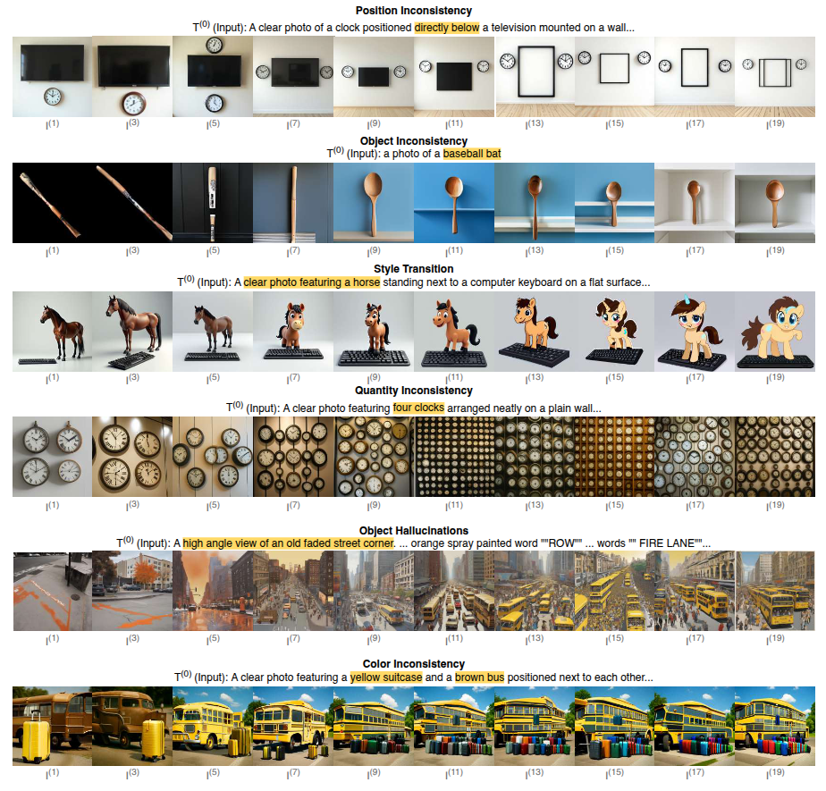

# Semantic-Drift-in-Unified-Models

#### University of Central Florida

[](https://arxiv.org/pdf/2509.04438v1)
[](./datasets/)
[]()

Official GitHub repository for  `The Telephone Game: Evaluating Semantic Drift in Unified Models`.

---

## 🏆 Highlights


> <p align="justify"> <b> <span style="color: blue;">Figure</span></b>: Information can be lost in different ways during a cyclic inference. In the first row, the model ignores the position of the clock, which is a crucial detail. In the second row, the model changes a baseball bat into a spoon. A model can also change the style from realistic to cartoon, as shown in the third row. In the fourth row the model loses count of four clocks and generates lots of clocks instead. In the fifth row a whole city is hallucinated around an empty road. In the sixth row, the model changes a brown bus into a yellow bus.

> **<p align="justify"> Abstract:** Employing a single, unified model (UM) for both visual understanding (image-to-text: I2T) and and visual generation (text-to-image: T2I) has opened a new direction in Visual Language Model (VLM) research. While UMs can also support broader unimodal tasks (e.g., text-to-text, image-to-image), we focus on the core cross-modal pair T2I and I2T, as consistency between understanding and generation is critical for downstream use. Existing evaluations consider these capabilities in isolation: FID and GenEval for T2I, and benchmarks such as MME, MMBench for I2T. These single-pass metrics do not reveal whether a model that “understands” a concept can also “render” it, nor whether meaning is preserved when cycling between image and text modalities. To address this, we introduce the Unified Consistency Framework for Unified Models (UCF-UM), a cyclic evaluation protocol that alternates I2T and T2I over multiple generations to quantify semantic drift. UCF formulates 3 metrics: (i) Mean Cumulative Drift (MCD), an embedding-based measure of overall semantic loss; (ii) Semantic Drift Rate (SDR), that summarizes semantic decay rate; and (iii) Multi-Generation GenEval (MGG), an object-level compliance score extending GenEval. To assess generalization beyond COCO, which is widely used in training; we create a new benchmark ND400, sampled from NoCaps and DOCCI and evaluate on seven recent models. UCF-UM reveals substantial variation in cross-modal stability: some models like BAGEL maintain semantics over many alternations, whereas others like Vila-u drift quickly despite strong single-pass scores. Our results highlight cyclic consistency as a necessary complement to standard I2T and T2I evaluations, and provide practical metrics to consistently assess unified model’s cross-modal stability and strength of their shared representations.

---

## Installation

```bash
git clone https://github.com/mollahsabbir/Semantic-Drift-in-Unified-Models
cd Semantic-Drift-in-Unified-Models
pip install -r requirements.txt
```

## 💻 Usage 

### MCD and SDR
Evaluation data should be organized as follows:
```
<evaluation_data_root>/
├── text-first/
│   ├── gen-0.csv
│   ├── gen-1
│   │   ├── image1.png
│   │   ├── image2.png
│   │   ├── image3.png
│   ├── gen-2.csv
│   ├── ...
│   ├── gen-20.csv
├── image-first/
│   ├── gen-0
│   │   ├── image1.png
│   │   ├── image2.png
│   │   ├── image3.png
│   ├── gen-1.csv
│   ├── gen-2
│   ├── ...
│   ├── gen-20
```

And the `csv` files used to store the captions should have the following two headings: `filename`, `caption`.

After making sure that the generated data along with the `generation 0` source data are in the correct format, run the following command to calculate `mcd`, and `sdr` metrics as mentioned in the paper:

```bash
python semantic-drift/mcd-sdr.py --data /path/to/data --out temp --model-name <model-name>
```

### MGG

1. Copy Geneval dataset metadata from: [here](https://github.com/JiuhaiChen/BLIP3o/blob/Qwen3-Siglip2/eval/geneval/geneval_prompt.jsonl), or [here](https://github.com/djghosh13/geneval/blob/main/prompts/evaluation_metadata.jsonl).

2. Run:
```
python semantic-drift/mgg.py --imagedir /path/to/data/text-first/     --metafile geneval_metadata.jsonl     --resultname <exp-name>   --resultdir /directory/to/save/results
```


## 📜 Citation
If you find our work and this repository useful, please consider giving our repository a star and citing our paper as follows:
```bibtex
@misc{mollah2025telephonegameevaluatingsemantic,
      title={The Telephone Game: Evaluating Semantic Drift in Unified Models}, 
      author={Sabbir Mollah and Rohit Gupta and Sirnam Swetha and Qingyang Liu and Ahnaf Munir and Mubarak Shah},
      year={2025},
      eprint={2509.04438},
      archivePrefix={arXiv},
      primaryClass={cs.CV},
      url={https://arxiv.org/abs/2509.04438}, 
}
```